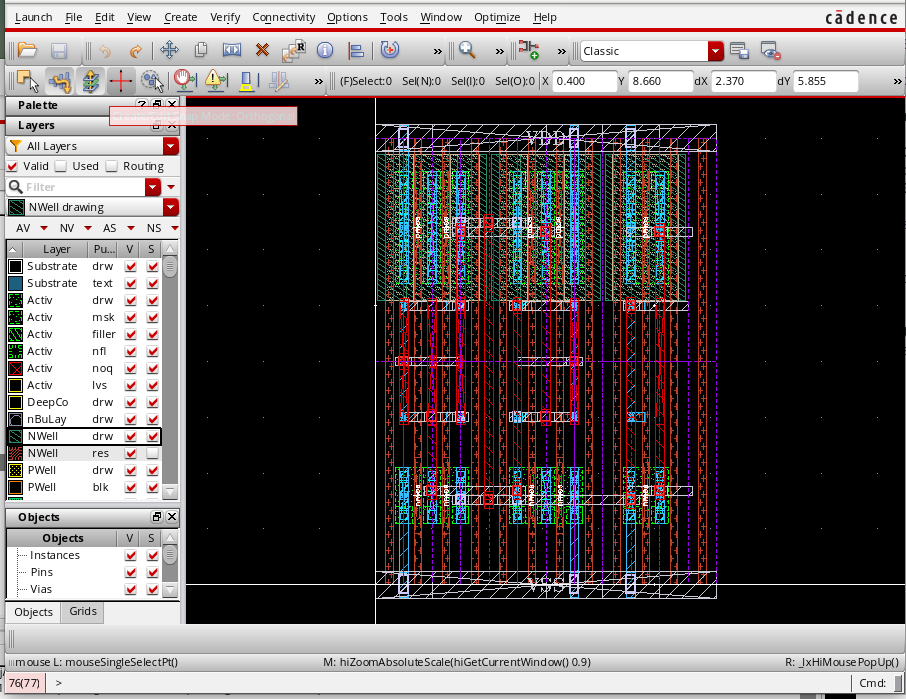

# CMOS IP

## Process
Currently, the following technologies are supported. However, a portting can be performed to support
all process.

- UMC_40
- TSMC_65, TSMC_18 
- GF_018, GF_65, GFSOI_035
- IHP_013
- SMIC_018, SMIC_55

## Basic Logics (schematic & layout in various process node)

- inv
- nand
- nor
- mux
- tgate
- d-latch
- sr
- dff
- dff with set/reset

