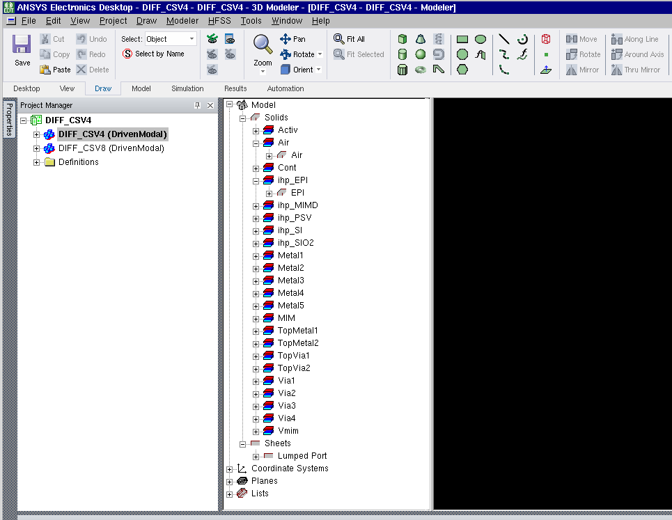
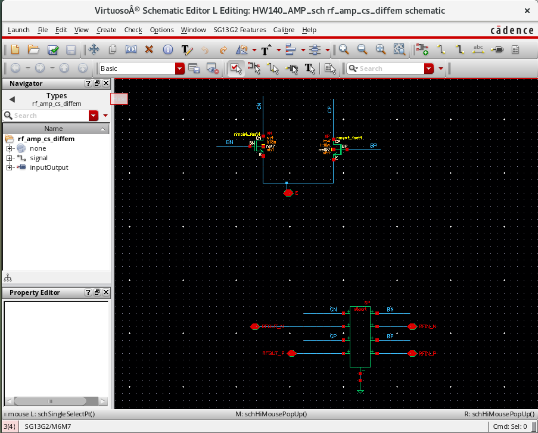

# Parasitic Extraction

The project is intended to parameterized core layout RF cell and its perphieral metal layout.

## Feautre

- The core layout is parameterized with number of device in paralle
- The AnsysEM simulation extracts metal connections inductance and coupling though full EM simulation
- Due to memory limitation, the layout view has not been rendered .

