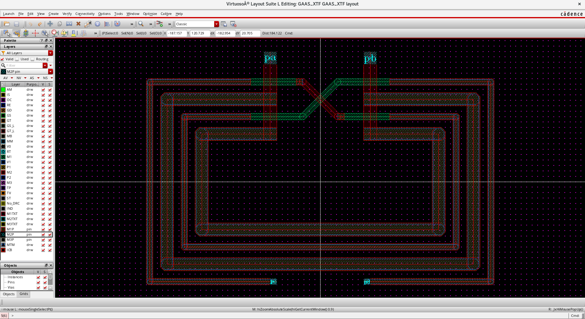

# Lateral-Coupled Transformer on GaAs 

The transformer is intended for on-chip impedance transformer between driver-stage and power stage for cellular power amplifier. 

## Feature

- The primary turn consists of 2 parallel coil
- The secondary turn consists of 2 coil in series
- Both turn using M1 and M2 stack with bar-type via

## AnsysEM Setup

Due to NDA, the substrated is not properly set. The project is just for illustration of RPA flow we developped. 

The project can be download 
