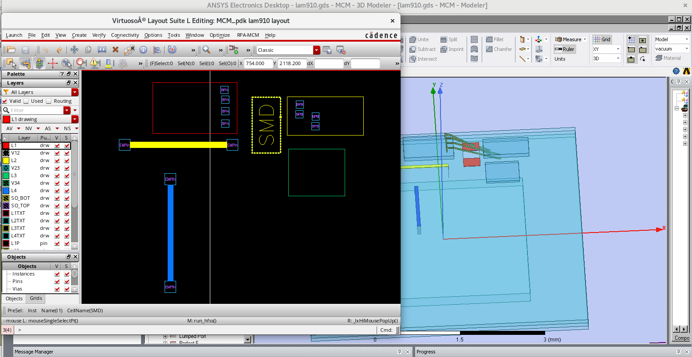

# MCMPDK

The advantage of this tookits are:

    1. perform multi-chip package design in virtuoso environment, support team collaboration throug OA data base

    1. perform quick EM modeling through one-click GUI menu(inlcudings, CMOS/HBT die, SMD devie, bondwires etc)

The toolkit basically defines

    - Cadence pcells

        * EMP: EM pins for quick HFSS model build up

        * SMD: SMD footprint 

        * BPA, BPB: bond pad indentifier for automatic bondwire model

    - AnsysEM flow

        * setup laminiate dielectrics

        * setup multi die integretion (CMOS, SOI, HBT etc.)

        * build 3d modeler of lamniate metals

        * build bondwire according to BPA, BPB

        * run simulation and perform results process

