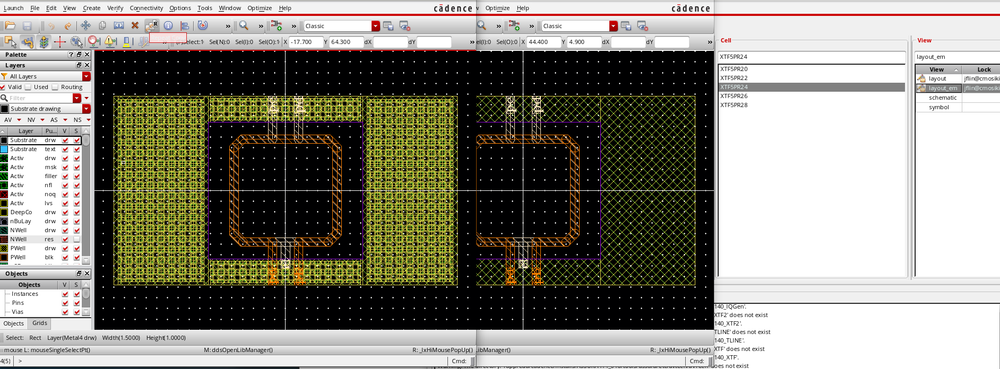
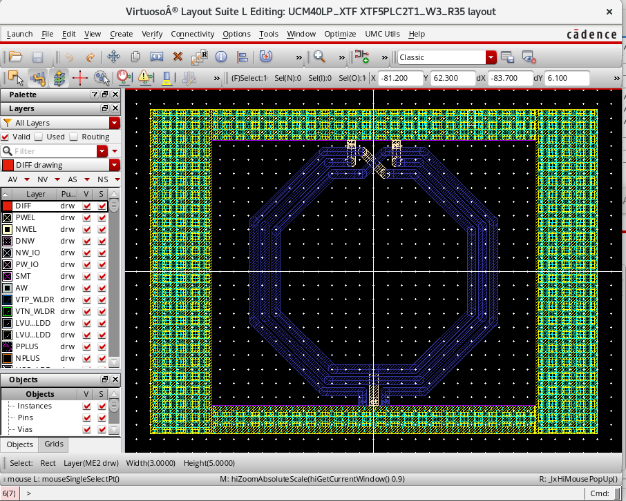
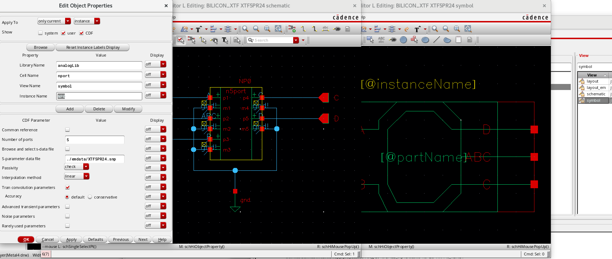
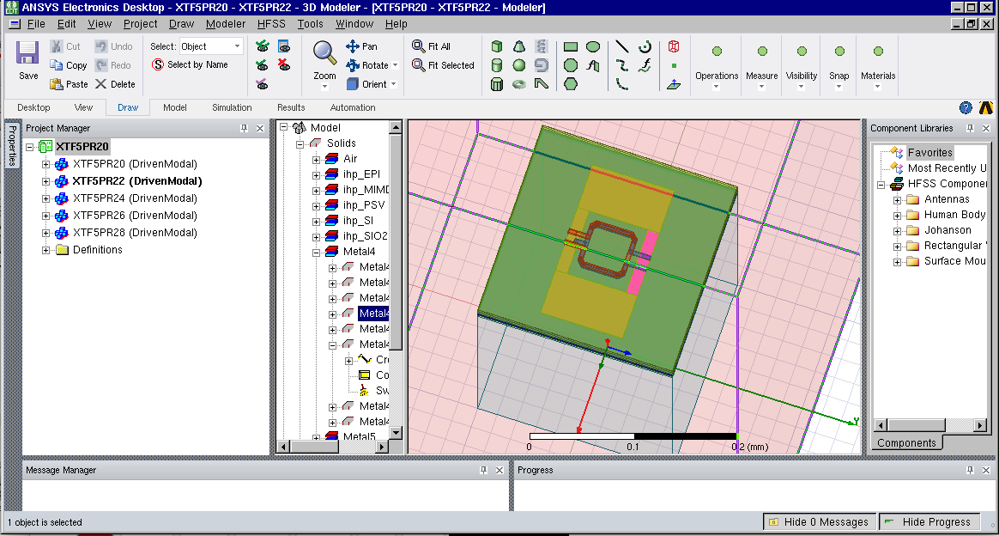
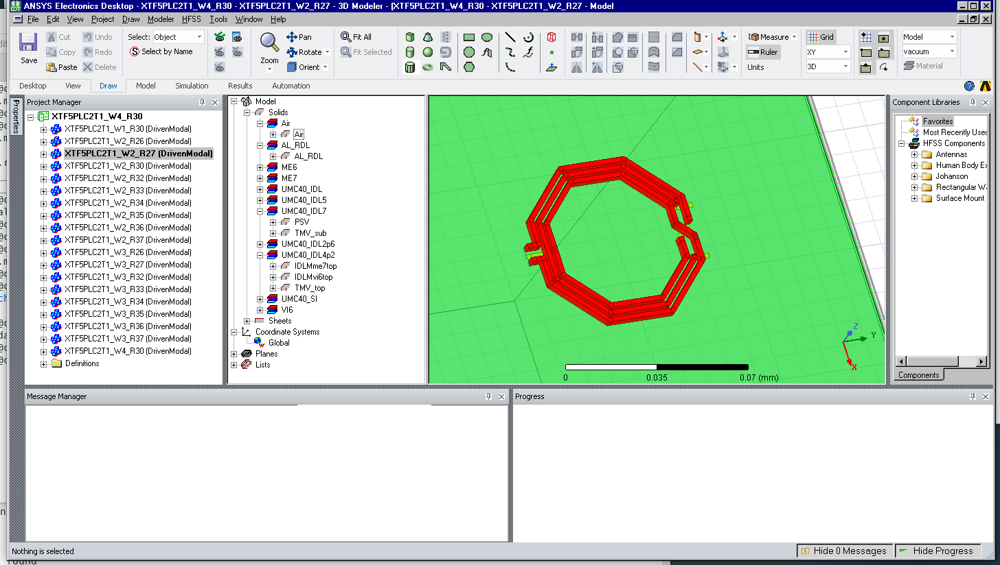
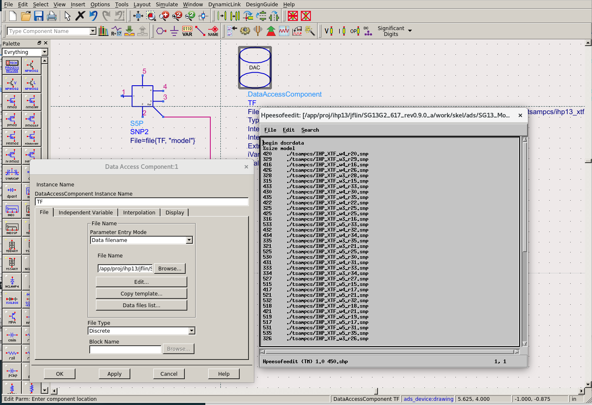

# Silicon On-Chip Transformer Modeling

We provide a zipped project includes flowing files:
- Cadence library with layout view and symbol view (./cds)
- Ansys EM project ready for simulation (./hfss)
- ADS cell view for wrapping touchstone batch into a data component model(.ads)

## Cadence Libary

The Cadence libary folder consists all generated design views,

### Features:
- Customization of all passive devices
- Adjustable dummy metal density and metal layer and geometries
- Schematic symbol with touchstone file setting
- Layout view with polygon off-grid error fix
- Layout view layout_em with via/dummy simplification for EM simulation setup
- Pins for all ports defauts(pa, pb, pc ..etc)

- The layout cell has fixed port gap for signal path
- The layout cell can be cascaded during system level implementation
- The EM view has been simplified to reduce simulation resource

- A symbol view has been created
- A schematic view with touche-stone file setting has been used
- *to do* add LVS stop
- *to do* LVS support for Assura

## AnsysEM Libary

- The AnsysEM project includes all designs in Cadence library with automatic EM simulation setups(port,
simulation sweeping etc.)

- A script tool for exporting simulaiton results and re-name simulaiton results as design name is also included for
convenience.

## ADS file

A configure file for data component model is included

