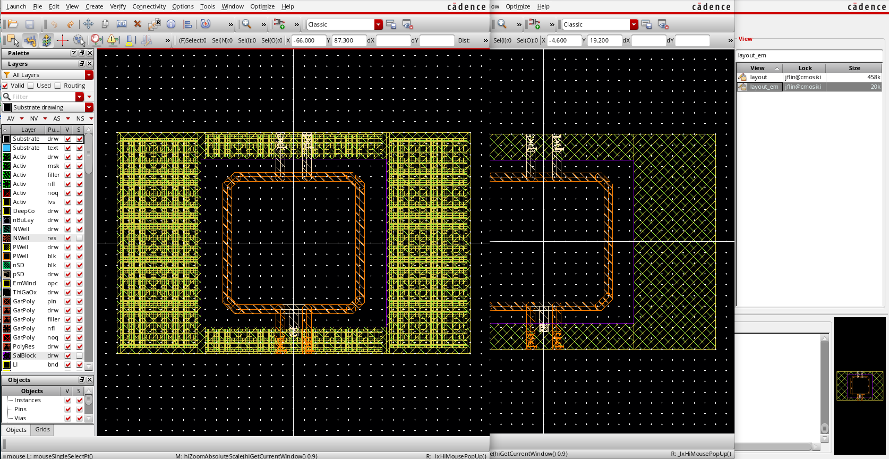

# Silicon On-Chip Transformer Modeling

We provide a zipped project includes flowing files:
- Cadence library with layout view and symbol view (./cds)
- Ansys EM project ready for simulation (./hfss)
- ADS cell view for wapping touchstone batch into a data component model(.ads)

## Cadence Libary

The Cadence libary folder consists all generatived design views,

### Features:
- Adjustable dummy metal density and layer
- Schematic symbol with touchstone file pointing 
- Layout view with polygon off-grid error fix
- Layout view layout_em with via/dummy simplification for EM simulation setup
- Pins for all ports defauts(pa, pb, pc ..etc)

### 

